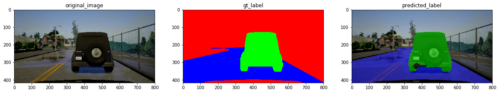

# **Udacity \- Lyft Challenge**

Final prediction on the test set:


Lyft Challenge leaderboard:


## **1.Semantic Segmentation**

The goals of this project are as follows:
* Build an algorithm that takes images as input and outputs labels for each pixel: road/car/background.
* The performance is evaluated by the weighted F score which emphasizes high vehicle recall and road precision.
* FPS below 10 leads to penalty so the algorithm should achieve possible real-time performance for actual deployments

## **2.Introduction**
In this challenge, the target images are generated from [CARLA Simulator](https://http://carla.org/). The training dataset is given by Udacity containing 1000 images and the hidden test dataset is compiled as a video file (~1000 images) for evaluating the algorithm. The original CARLA generated images containing 12 classes; however, in this challenge the goal is to identify only the road and vehicle classes. High vehicle recall and road precision are demanded as reflected by the weighted F score:


where Beta is 2 and 0.5 for vehicle and road, respectively. The Final score is the average of F_car and F_road with the additional penalty score of min( FPS-10, 0).

## **3.Algorithm Development**

### Background
There are great variety of algorithms on hands these days and the state-of-are approaches are based on neural-networks. Although it is possible to derive conventional feature-based algorithms, the neural-networks (NN) provide great easiness and accuracy in modeling the probability distribution of the data. For the NN-based approach, in general, the task of semantic segmentation requires labeling each pixel into the defined classes, which is different from image classification that predicts an entire image. Thus, modifications are generally required by extracting the feature maps from pre-trained image classifiers (normally referred as backbone). The feature maps closer to the output are normally of the smaller spatial size with deeper depth, leading to latent states encoding of the images with higher receptive areas and finer classes (channels). Since an object can appear in a image in different sizes, multiple scales of feature maps are generally considered for better performance. Long et al. proposed the Fully Convolutional Networks (FCN) for semantic segmentation [[FCN](https://people.eecs.berkeley.edu/~jonlong/long_shelhamer_fcn.pdf)] and has become a very popular structure for such a task. The multiple feature maps are up-sampled (with deconvolution layers) to recover the original input size for pixel-wise labeling to enable end-to-end training. Similar concepts can be commonly seen in different methods such as SegNet, RefinedNet, PSPNet, etc [[link]](http://blog.qure.ai/notes/semantic-segmentation-deep-learning-review). As of today, the state-of-the-art approach seems to be DeepLab proposed by Chen et al [[Deeplab](https://arxiv.org/abs/1706.05587)]. The major difference to the above methods is the adoption of atrous convolutions with atrous spatial pyramid pooling (ASPP) and Fully-connected Conditional Random Field (CRF). The atrous convolutions avoid repeated combinations of striding and deconvolution to achieve efficient computations. The flexibility is given by tuning the rate of the atrous convolution to allow different views of field. Then, the coarse feature maps are then "translated" by the probabilistic graphical models - CRF to obtain refined belief maps. Although it seems promising, the adopted algorithm is based on the FCN and the further exploration of Deeplab is considered for the follow-up work.

### Model Adoption
The story of the architecture selection was originally derived from seeing the amazing results from Mask-RCNN for object detection. Therefore the first version of the work was the adoption of the ResNet backbone (ResNet50 and 101) of Mask RCNN implemented in Keras with provided pretrained weights [[matterport](https://github.com/matterport/Mask_RCNN)]. The graph was then converted back to pure Tensorflow models with feature extractors attached. The initial results seem very promising and achieve final  test score of 90.2. However, there was an issue when freezing the networks as in the version of Keras being used, the is_training variable for the batch normalization can not be (or is difficult to) set so that the frozen network, thus optimized and fused networks, do not perform well in terms of inference time (~7 FPS). Therefore, I further searched around different model zoos and decided to proceed with Tensorflow-Slim and adopted the ResNet_V2_101 pr-etrained model [[slim](https://github.com/tensorflow/tensorflow/tree/master/tensorflow/contrib/slim)]. The ResNet backbone contain 4 blocks and each block contain multiple units (bottleneck) that generally has a structure of Batchnorm-Conv-Conv-Conv-Merge_short_cut. Due to the FPS requirement, I had to truncate the tail and preserve the graph with the weights until Block3/Unit11. The feature map extractor are then superimposed on top of the pretrained ResNet. The diagram and details of the graph are shown:


| Layer         		     |     Description	        		        		           |
|:----------------------:|:---------------------------------------------------:|
| Input         		     | 416x800x3  image   							                   |
| Block1/Unit2           | 4x4 stride, output 104x200x256                      |
| Block2/Unit3           | 8x8 stride, output 52x100x512                       |
| Block3/Unit11          | 16x16 stride, output 26x50x1024                     |
| C4/Relu                | Input Block3/Unit11                                 |
| C4/Conv                | 1x1 filter, output 26x50x3                          |
| C4/Conv_tranpose       | 4x4 filter, 2x2 stride, outputs 52x100x3            |
| C3/Relu                | Input Block2/Unit3                                  |
| C3/Conv                | Input  Block2/Unit3, 1x1 filter, output 52x100x3    |
| C3/add                 | Merge C4                                            |
| C3/Conv_tranpose       | 4x4 filter, 2x2 stride, output 104x200x3            |
| C2/Relu                | Input Block1/Unit2                                  |
| C2/Conv                | Input  Block1/Unit2, 1x1 filter, output 104x200x3   |
| C2/add                 | Merge C3                                            |
| C2/Conv_tranpose       | 8x8 filter, 4x4 stride, output 416x800x3            |
| Softmax 		           | 416x800x3 output   		                             |                         

The code can be found in [link](model.py):

### Data Collection, Pre-processing, and Augmentation
The original dataset given by Udacity contains only 1000 images, which may not be sufficient to prevent overfitting. So in the beginning, I performed augmentation [imgaug](https://github.com/aleju/imgaug) on the image by randomly adjust the hue/saturation (mainly affecting vehicle colors), contrast, and brightness. However, the results are not very satisfactory. Since the dataset is artificial, so we can leverage the idea of generating more data through CARLA simulators. It should also be noticed that there is an issue of collecting video stream images as they are highly correlated. Thus, I made up a strategy of collecting only few images for each episode of the simulation. This really helps to break the correlation and helps the network to generalize better. But it is also important to note that the same vehicle may appear in different sizes (far/close), so we need to balance both by adjusting the recording frames per seconds. I ended up collecting 22k samples (with an additional collection of valid set of ~2k) and did not use the augmentation as the training became relatively heavy.

Since the unprocessed label images contain 12 classes and we really do not what to fit the vehicle hood, so I manipulated the labels and cropped the images to 416x800 (Y axis - 102:518). This brings some advantages of increasing training/inference speed and avoid fitting the vehicle hood. The sampled image is shown:


However, there might be potential risks as we do not know the camera position of the test set images so if the image is off by some pixels, we may ended up cropping too much of the bottom. I then cross-checked the provided sampled videos and the training data and assume that there should be no change of camera position. Apart from cropping issues, the camera position may affect the performance of the network if it dose not preserve spatial invariance. In fact, this issue is considered as one of the follow-up tasks since in reality the recorded videos may come from different cars with different camera positions.

To prevent cropping too much of the top side, I also checked the accumulated heatmap of the vehicle positions over the entire training images, as shown:


Since the scoring bottle neck is the vehicle score as classifying roads is not an issue, I examined the total samples/pixels of different classes and found that the ratio is about: background:vehicle:road = 30:1:14. This means that the data is unbalanced between classes so that the loss function may not reflect what we intend to do - boosting the car score. Thus, we need to make some adjustments for the training strategy.

### Training
#### *loss function*
Due to unbalance data, I adjusted the weights of the cross entropy loss by using:


This means that I can adjust the weight distribution to enhance the recall of a particular class and to rebalance the samples. After some investigation, I ended up using the weights of [0.3 2.4 0.3] as compared to the regular weights of [1 1 1] by keeping the same total sum. This strategy helps to increase the car score of my validation set. The code is shown as:
```python
class_weights = tf.constant(weights,dtype=tf.float32)
logits = tf.reshape(nn_last_layer, (-1, num_classes),name = 'logits')
correct_label = tf.reshape(correct_label, (-1, num_classes))
weights = tf.reduce_sum(class_weights * correct_label, axis=1)
unweighted_losses = tf.nn.softmax_cross_entropy_with_logits(labels = correct_label, logits =logits)
weighted_loss = tf.reduce_mean(unweighted_losses * weights)
softmax = tf.nn.softmax(nn_last_layer, name = 'softmax')
reg_losses = tf.get_collection(tf.GraphKeys.REGULARIZATION_LOSSES)
total_loss = tf.add(weighted_loss, tf.reduce_sum(reg_losses),name = 'cross_entropy_loss')
optimizer = tf.train.AdamOptimizer(learning_rate = learning_rate)
extra_update_ops = tf.get_collection(tf.GraphKeys.UPDATE_OPS)
with tf.control_dependencies(extra_update_ops):
    train_op = optimizer.minimize(total_loss, name = 'train_op')
```

#### *Training parameters*
The parameters were obtained based on coarse grid search using a smaller dataset:
- Batch size: 2-4 images
- Weights: [0.3 2.4 0.3]
- Regularization: 1e-4
- Initial learning rate: 5e-4

#### *Training Strategy*
I did coarse training using large learning rate of 5e-4 (with decaying strategy) for around 80 epochs and then fine-tuned the model using around 5e-5 ~ 1e-5 for additional 20~40 epochs. Meanwhile, I kept generating new data so that whenever introducing new data, I only did the fine-tuning of the network for ~10 epochs. Thus, I could gradually observe the improvement given by the additional data. After completing the data collection, I did fine-tuning for another 20 epochs with a small learning rate. Based on my workstation with Nvidia 1080Ti single gpu, the entire epoch consumes ~40 mins for 22k samples.

### Frozen, Optimized, and Fused Net
I found that Tensorflow optimization tool may not be able to further convert the variables of batch normalization to constants whenever the placeholder is created for is_training. Thus, I constructed a duplicated graph with the is_training placeholder set to a constant and loaded the weights of the original graph so that the optimization works without losing inference accuracy. I then proceed to freeze, optimize, and fuse the graph for inference deployment. The actual inference engine is located at ```./inference_pb/fused_graph.pb```.

## **4.Prediction Results**
The obtained softmax map is then processed by using np.argmax to identify the most possible class per pixel. The final results of the internal test set (1000 samples collected from CARLA) is:
```
Pixel Accuracy: 0.994026, Mean Accuracy: 0.958664, Mean IU: 0.950347
Car Precision: 0.881 | Car Recall: 0.982 | Road Precision: 0.997 | Road Recall: 0.994
```

The final results of the test set is:
```
Your program runs at 10.204 FPS
Car F score: 0.852 | Car Precision: 0.743 | Car Recall: 0.885 | Road F score: 0.988 | Road Precision: 0.990 | Road Recall: 0.981 | Averaged F score: 0.920
```
Some good sampled results are shown:


Some bad sampled results are shown:




Also, here provides a link to the video of the test set [[click](./videos/test_video1.mp4)].


## **5.Discussions**
Some possible improvements and further follow-up tasks:
- exploration of DeepLab to achieve better performance and FPS
- adding image augmentation back with image flipping (although the CARLA is built based on US road systems but it could help to generalize better to achieve spatial invariance of roads)
- training with different camera positions
